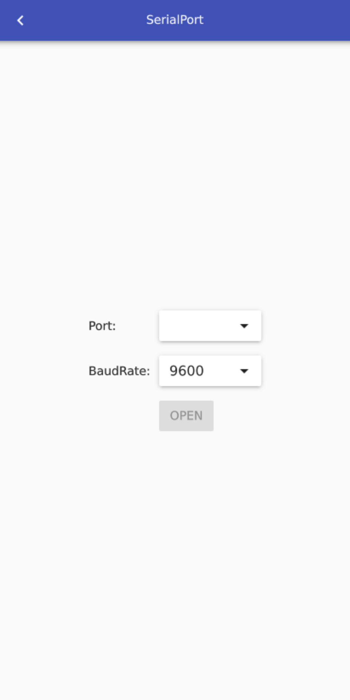

# E46Track

E46Track is a "not so serious" Real-Time Telemetry application for BMW E46 M3 owners. It is more like a toy due to latency problems.

**What data is collected?**
 - speed (km/h)
 - engine rpm
 - steering angle (°)
 - yaw rate (°/sec)
 - lateral G (g)
 - brake pressure (bar)
 - throttle sensor position (V)

**What can you do with the collected data?**
 - replay them with E46Track
 - export frames for video rendering from E46Track
 - whatever you like, it's a simple CSV

**Do I need to modify my car in any way?**
 - No, not for this app.

**Why it is a "not so serious" application?**
 - The data is queried from the car (the same way as you go live diagnostic mode with INPA software).
 - Need to make 5 separate queries each takes up 150ms (one is 250ms). The queries are configurable, e.g: speed is disabled by default.
 - Anyway the replaying tool interpolates the data series, it is enhanced a bit.

 **Why don't I use CAN?**
  - There are already cool options out there. [RaceCapture](https://wiki.autosportlabs.com/BMW_E46_CAN)
  - The goal of this project was to get familiar with my car and improve myself and share the knowledge with everyone interested.


## Screenshots

**Video frame**


**Android App**


**Raspberry App**





## Requirements

 - **Technical skills and patience!**

 - BMW E46 M3

   - If you have INPA, make sure these options work for you:


 - WiFi K+DCAN interface or K+DCAN cable and a Raspberry Pi / Laptop


 ## Android App
  - **Mobile data must be disabled!**
  - Connect your mobile phone to the WiFi K+DCAN interface's WiFi hotspot
  - The gateway's IP address should be configured in the app's settings, the port should be 35000.
  - Unfortunately my Nokia 7 Plus adds some periodic delay on the communication, that's why I moved for a Raspberry Pi setup.
    - GPS data logging would be an awesome feature. It would improve the logging as well, since I could spare a 250 ms query for the speed.

## Raspberry Pi deployment

[DETAILS](https://github.com/tomicooler/E46Track/tree/master/raspberry)

## Under the hood

 - Basically E46Track mimics the INPA BMW diagnostics software.
 - E46Track communicates with the car, the same way as INPA does - DS2 protocol - a request response
   binary protocol.
 - NOTE: the WiFi K+DCAN interface adds an additional framing over the DS2 requests. Details later.

**DS2 request**
```
12050b031f
```

 - 12: motronic ECU   (address)
 - 05: 5 bytes long   (length)
 - 0b03: data
 - 1f: checksum       (xor bytes[0]..bytes[length-1])

**DS2 response**
```
122da002c30000000038003899bbb5a7c80188fc4e64359c79887c2f7c55fefefefe1447097605050d2e9086c2
```

 - 12: motronic ECU
 - 2d: 45 bytes long
 - a0: acknowledged
 - ..: data
 - c2: checksum

NOTE: It looks like that the ECU address for DSC module is 3 bytes long (b829f1), and the length
field's value equals for the data size without the ecu address, length field and checksum field's
size. The response starts with a 3 bytes address also (b8f129).

Further information: [BMW E46 Oil](https://github.com/tomicooler/bmwe46oil)

## Reverse engineering

Environment
 - WiFi K+DCAN interface and a running INPA
 - Wireshark for capturing the network traffic
   - if your INPA runs in a VBOX then Wireshark should be installed on your host
 - tools/scripts from my BMW E46 Oil project (branch: [e46track-app-reverse-engineering](https://github.com/tomicooler/bmwe46oil/tree/e46track-app-reverse-engineering/scripts))
   - inpatrafficparser --help for details

**WiFi K+DCAN interface additional framing**

```
000212c02100003c00[LENGTH][DS2REQUEST][CHECKSUM]
```

This was pretty easy, the framing always starts with a 9 bytes long header then a LENGTH field
which is the length of the whole DS2 request then the actual DS2 message and a CHECKSUM.
The CHECKSUM is just an addition of the bytes[0]..[size-1] on a 8-bit signed two's complement integer.

**Throttle pedal position (V) [0-5, mine goes from 0.75-3.96]**


```
DS2 request: 12050b031f
DS2 response: 1227a0000003b600000000000069858b65073a7c8181a600080001e201dd0223022f0223635ce0
```

Two byte is used for the encoding. Let's call this a two byte "step" encoding.
As I found out, the first byte is the "big_step" (8 bit signed two's complement integer if the value can
also be negative) the second byte is the "small_step". The value can be calculated as follows:
```
value = big_step * 2.56 + small_step / 100.0
```
Cool, isn't it?

The byte 24 (big_step) and byte 25 (small_step) is almost OK, but need to be scaled a bit for better
match.

```
10.85 * multiplier + offset = 3.96
0 * multiplier + offset = 0.75

multiplier ~= 0.295
offset ~= 0.75
```


**RPM (revolutions per minute)**


```
DS2 request: 12050b031f
DS2 response: 1227a00ceb036600b1024d007966808c6a0e3a888181a600810000000000000100000000635c35
```

Two byte "step" encoding.

```
big_step = byte 1
small_step = byte 2
additional multiplier = 100
```


The resolution of the data was just 1 seconds~ that's the only problem with the chart.

**Speed (km per hour)**


```
DS2 request: 12050b130f
DS2 response: 125ea00037037000000f730f560f740f7f0f500f9e0f7a0f7a012a012a012a012a012a012a000000007f3c7f1881a200000000000200000000000000000000fb0500000000000000000000000a23127200007276011330000000000000dc
```

Byte position 2 as unsigned integer. TODO: what happens over 255 km/h? Maybe + unsigned bytepos 1?


**Brake pressure (bar) [-10:200, mine goes from -0.7-100]**


Brake pressure, Steering angle, Lateral G and Yaw Rate comes in one screen in INPA.
Three different requests is used, one goes for the offsets. I don't use the offsets, but the request
must be sent, otherwise the communication stops after N minutes.

Offsets
```
DS2 request: b829f102210241
DS2 response: b8f1290c6102fb62f680fbc007640000b8
```

Brake pressure, Yaw Rate, Lat G
```
DS2 request: b829f102210645
DS2 response: b8f1290f6106ff00c3dcffa5ff6533d501c3131f
```

Brake pressure:
```
big_step = byte 6
small_step = byte 7
```


Yaw Rate (degree/sec) [-60,60]:
```
big_step = byte 10
small_step = byte 11
additional multiplier = 0.1
additional offset = 2.85
```


Lat G (g) [-1,1]:
```
big_step = byte 12
small_step = byte 13
additional multiplier = 0.1
```


Steering angle (degree) [-600,600]:
```
DS2 request: b829f1032201f5b5
DS2 response: b8f1290c6201f5010110dd8180810000b7
```

left: positive, right: negative

Encoding: two byte LSB. The first bit is the negative bit. It is not a 16-bit signed two's complement integer like short in Java.

```
multiplier = 0.045
```


